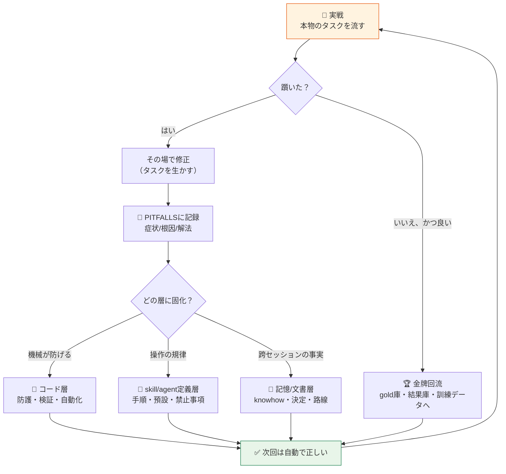
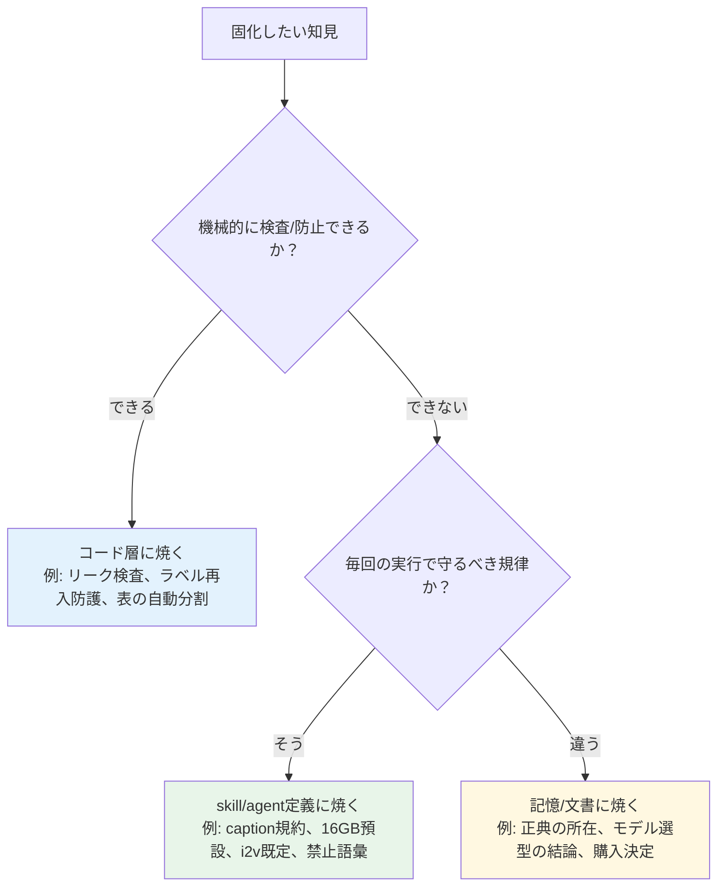

# AIエージェント育成標準 v1.0
## — Skill Cultivation Standard —

> 制定: 2026-07-03。適用範囲: AIエージェント/skill/workflowを持つ全プロジェクト。
> 実証元: 画像生産PJ・業務AI(ai-stack)・MV制作PJ・LoRA訓練の4系統で同一ループが成立することを確認済み。
> この文書は「何を作るか」ではなく「**システムをどう育てるか**」の標準を定める。

---

## 1. コア原則（5箇条）

1. **Skillは書くものではなく、蒸留するものである。**
   理論から書いたskillは弱い。実戦の踩坑と勝ちパターンを蒸留したskillだけが強い。
2. **狗糧原則: 本物のタスクで育てる。**
   合成テストは実データの罠を想像できない（実証例: 「体制図の人名は敬称なし」「4人ダンスで人が増える」は本物を流すまで発見できなかった）。
3. **未記録の成功は、工程違反である。**
   当たっても記録がなければ再現できない＝存在しなかったのと同じ。記録は同セッション内に行う（後でやるは、やらない）。
4. **金牌は回流させる。**
   合格した産出物は納品して終わりではない。金牌庫・結果庫・訓練データとして次サイクルの燃料になる。**産出物＝訓練データ**。
5. **生成者と検査者は分離する。**
   自産自評のQCは必ず甘くなる（実証済み）。QCは第三者エージェントが行い、疑わしきは不合格に倒す。

---

## 2. 標準ループ

## 3. 三層固化の判定

判定のコツ: **上の層ほど強い**（コード層は人が忘れても効く）。迷ったら「これを人間の注意力に頼ったら事故るか？」で決める。事故るならコード層へ。

---

## 4. 必須アーティファクト（全プロジェクト共通の置き場）

| アーティファクト | 役割 | 実例 |
|---|---|---|
| **PITFALLS.md** | 踩坑の一次記録（症状/根因/解法） | 本ディレクトリのPITFALLS.md。画像生産PJはskill内落とし穴節 |
| **結果庫**（outcomes） | 全生成/全実行の構造化ログ（成功も失敗も）。標準語彙のfailure_modes必須 | MV制作PJ `library/prompt_outcomes/outcomes.jsonl` |
| **金牌庫**（gold） | 採用作の注釈付き範例（なぜ良いかを手法名で注釈） | MV制作PJ `library/story_gold/`、LoRAのground truth |
| **CHANGELOG** | パイプライン自体の変更履歴 | MV制作PJ CHANGELOG.md |
| **agent/skill定義** | 規律の置き場（プロジェクトの流儀に従う: .codex/agents / .claude/skills 等） | 各プロジェクト |
| **成果カード** | 大きな成果物の再現条件記録 | LoRA訓練カード、Suno generation_log |

## 5. QC規律（標準）

- **分離**: 生成エージェント（機械的・低effort）と QCエージェント（第三者・高effort）を分ける。リトライループはworkflowが制御する。
- **厳格**: 疑わしきは不合格。数えられるものは1つずつ数える（指・人数・章・実体）。
- **双方向**: 入口だけでなく出口も検査する（例: 脱敏は送信前チェック+産出物の再チェック）。
- **比較採点**: 創作系は合否でなく変体競争＋比較採点＋良所の接ぎ木（評委モデル）。
- **QC自体の記録義務**: 判定のたびに結果庫へ1行。漏れはQC工程の違反。

## 6. 変体競争（創作系タスクの標準形）

単発生成→修正の反復より、**異なる枠組みで3案並行→評委が比較→勝者に敗者の良所を接ぎ木**が安定して強い。
適用例: story 3変体（劇的枠違い）、設計案の判定パネル、LoRAのcheckpoint比較（epoch別A/B）。

## 7. 新プロジェクト立ち上げチェックリスト

1. ☐ **正典（ground truth）を最初に確定**し、所在を記録する（例: キャラシート、金牌設計書、採用曲テイク）。派生物を正典と混同しない（実証済みの事故源）
2. ☐ PITFALLS.md を空で作る（1個目の坑は初日に来る）
3. ☐ 結果庫のschemaを決める（failure_modes標準語彙を先に定義）
4. ☐ 生成/QCエージェントを分離した形で定義する
5. ☐ 「同セッション回填」をagent定義に義務として書く
6. ☐ 薄切片（最小E2E）を最初に通す。各層のインターフェースを固定し、後から各層を厚くする
7. ☐ 本物のデータ/タスクを最初の1週間以内に流す（狗糧原則）
8. ☐ CHANGELOGを開始する

## 8. 4系統での実証対照表

| ループ環節 | 画像生産PJ | LoRA訓練 | 業務AI(ai-stack) | MV制作PJ |
|---|---|---|---|---|
| 正典 | キャラシート(ref_sheet) | ground truth面板×高repeats | 金牌設計書/過去案件 | 採用曲テイク/採用story |
| 実戦駆動 | 量産の実需 | 実キャラの顔固定要求 | 実顧客PPTX | 11曲の実制作 |
| 結果庫 | produce-qc判定履歴 | 訓練カード+A/B | PHASE0-RESULTS | prompt_outcomes.jsonl |
| 金牌回流 | QC合格図→LoRAデータ | 最良checkpoint選抜 | 優良先例→RAG語料 | story_gold/ |
| コード層固化 | seed防護/温度ゲート | dataset.toml検証 | リーク双方向検査 | (次: outcomes検索の自動化) |
| 規律層固化 | nsfw-produce選型矩陣 | caption規約/16GB預設 | CLAUDE.md規約 | 禁止語彙/i2v既定/回填義務 |
| QC分離 | 生成agent≠QC agent | 訓練≠A/B評価 | 構造検査+人間最終確認 | prompt-qc/video-qc独立 |

---

## 9. 運用と版数

- 本標準の変更は CHANGELOG 付きで版数を上げる（v1.0 → v1.1…）。
- 各プロジェクトは本標準への**適合状況**を四半期に一度セルフチェックする（§7のチェックリスト流用）。
- 関連文書: `FLOW.md`（業務パイプライン具体図）/ `AI研究会-学習と業適用の基礎.md`（学習原理）/
  各プロジェクトのPITFALLS。

> 一言でいえば: **「システムを作る」のではなく「システムが育つ仕組みを作る」。** 使うほど強くなる構造こそが、単なるAPI利用者との差である。
