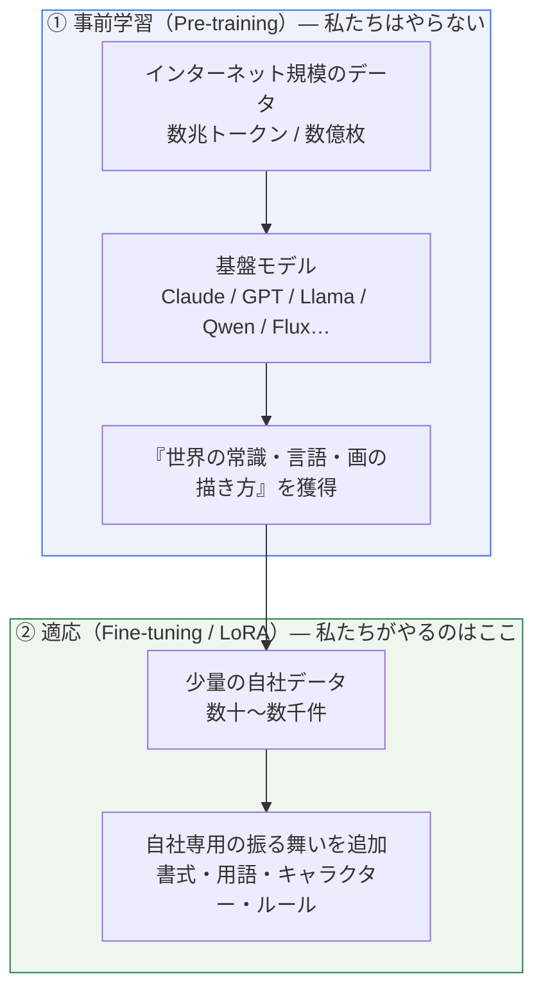
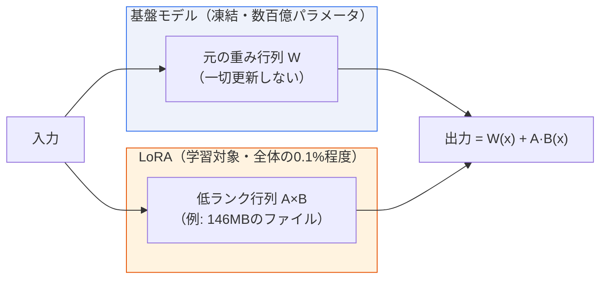
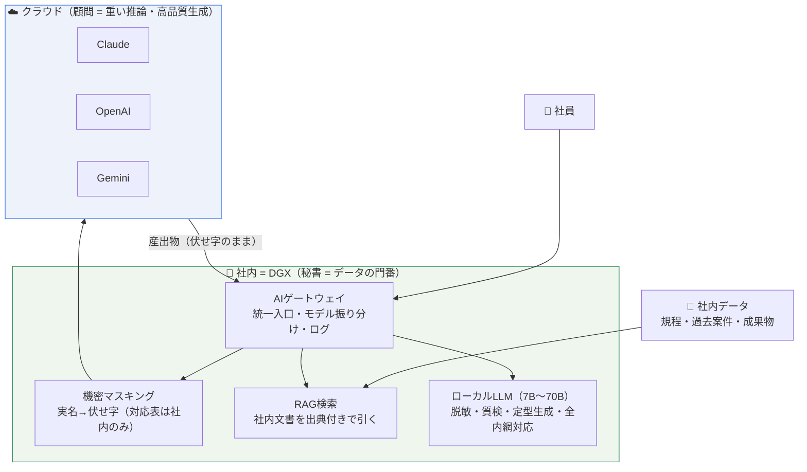
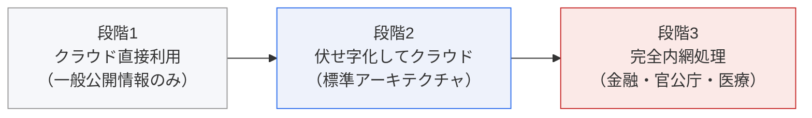
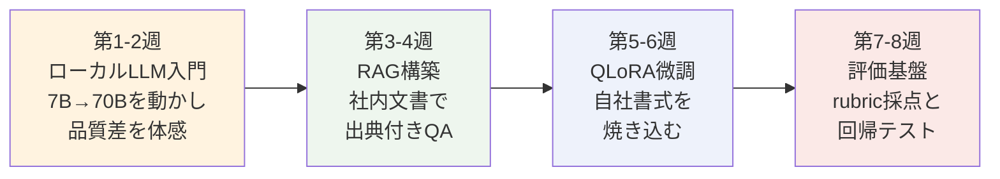

# AI学習の基礎と業務適用
## — AI研究会 スタートアップ資料（DGX 128GB 活用前提）—

> 2026-07-03 作成。対象: これからLLM/生成AIの研究を始める社内メンバー。
> 前提: DGX（128GB統合メモリ）購入済み。ゴール: 「セキュリティ要件の厳しいお客様に、ローカルで一定規模のモデルを動かす」提案力・実装力の獲得。

---

## 1. まず全体像：AIの「学習」には2段階ある

**最重要の直感**: 適応に必要なデータ量は「画像か文字か」では決まらない。**「モデルに教える"新情報"の量」で決まる。**

| 教える内容 | 必要データ | 例 | 適した手法 |
|---|---|---|---|
| **同一性**（特定の顔・ペット・製品の外観） | 数十枚 | 実写キャラ52枚でLoRA成功（社内実証済み） | 画像LoRA |
| **規則・書式・文体**（業務の入出力パターン） | 数百〜数千対 | 要件書→設計書の変換規則 | テキストLoRA/SFT |
| **知識**（社内規程・過去案件の中身） | ― | 「◯◯手当の申請条件は？」 | **学習ではなくRAG**（後述） |

> ⚠ よくある失敗: 「知識」を学習で教えようとする。コストが高い上に、モデルは平気で記憶を混ぜて幻覚を出す。知識は**検索（RAG）で都度渡す**のが正解。学習で教えてよいのは「振る舞い」だけ。

---

## 2. LoRAの原理：巨大モデルは凍結し、「補丁」だけ学習する

- 学習の実体: 「データ1件 → 出力を予測 → 正解との誤差(loss) → 補丁のみ微調整」を数千回繰り返す
- **トリガー語の仕組み**（社内実証で確立した規律）:
  学習データの説明文(caption)に**服装・背景・光は書くが、対象の外見は書かない**。
  すると「毎回写っているのに説明されていない特徴」の帰属先がトリガー語しかなくなり、
  `miyu woman` のような合図語に同一性が焼き付く。
  逆に**光・雰囲気を書き忘れると、それまでトリガー語に焼き付いてしまう**（実証: 撮影スタジオの暖色が全生成に伝染）。
- 過学習: 学習しすぎると背景や構図まで焼き付く。**2エポックごとに保存し、後から最良点を選ぶ**のが定石。

---

## 3. 業務適用の全体アーキテクチャ：「三人の顧問と一人の秘書」

役割分担の原則:
- **機密判定・データ管理は必ずローカル**（機密は伏せ字化してからしか外に出ない）
- **重い推論・長文生成はクラウド**（最高品質のモデルを使い分ける）
- **高頻度・定型・全内網案件はローカルLLM**

---

## 4. セキュリティ要件の3段階と、DGXが必須になる場面

| 段階 | データの扱い | 必要な社内設備 | 生成品質の上限 |
|---|---|---|---|
| 1. クラウド直 | そのまま送信 | なし | 最高（フロンティアモデル） |
| 2. 伏せ字+クラウド | 機密のみローカル処理 | 小型GPU（7-8BのLLMで足りる） | 最高（本文はクラウド生成） |
| 3. **完全内網** | **一切外に出さない** | **DGX級（70Bクラスが必要）** | ローカルモデルの実力＝製品品質 |

**段階3こそDGXの主戦場。** 7Bと70Bは日本語ビジネス文書・複雑な抽出・多段推論で**質的な差**があり、
「全内網でも実用品質」と言えるのは70Bクラスから。これは16GBのGPUでは物理的に載らない。

### DGX(128GB統合メモリ)で具体的に解錠されるもの

| できること | 16GB GPU | DGX 128GB |
|---|---|---|
| ローカルLLM推論 | 7〜14B | **70Bクラス+（量化でさらに上）** |
| ローカルLLMの微調（QLoRA） | 7〜14B | **70Bクラス** |
| 長文脈処理（10万トークン級のKVキャッシュ） | ✗ | ✓（統合メモリの主場） |
| 部門試行の同時接続（バッチ推論） | 数人 | 数十人規模 |
| 画像・動画モデルの学習/推論（別プロジェクト） | 制限付き | 14B級動画モデルもフル精度 |

---

## 5. 研究会の実習ロードマップ（DGX到着後の最初の8週間）

| 週 | 実習課題 | 到達目標 |
|---|---|---|
| 1-2 | Ollama/vLLMで 8B と 70B を両方動かし、同じ業務プロンプト（要件整理・議事録要約）を比較 | 「モデル規模と品質」の肌感覚。全内網档の品質説明ができる |
| 3-4 | 社内文書100件でRAGを構築（埋め込み→検索→出典付き回答）。権限フィルタの設計 | 「知識はRAG」の実装経験 |
| 5-6 | 自社の文書ペア数百件でQLoRA微調。学習前後をブラインド比較 | 「規則は学習」の実装経験。caption/データ規律の体得 |
| 7-8 | 評価rubric作成、モデル更新時の回帰テスト自動化 | 「品質を数字で語る」文化の確立 |

**教材はすでに社内にある**:
- 参考実装: `ai-stack`（脱敏→RAG→生成→質検のE2E、実案件で実証済み）
- 学習の実践記録: 画像LoRAプロジェクトの一連のknowhow（データ整備・学習・評価・反復の全工程）
- 提案側資料: `生成AI導入のご提案-お客様向け説明資料.md` / `企业AI导入提案-构想评估与落地手册.md`

---

## 6. 用語ミニ辞典（研究会の共通語彙）

| 用語 | 一言で |
|---|---|
| 基盤モデル | 事前学習済みの巨大モデル。私たちは借りる側 |
| LoRA | 基盤を凍結し小さな補丁だけ学習する省資源の適応法 |
| SFT | 入力→出力のペアで教える教師あり微調 |
| QLoRA | 基盤を量化(4bit等)してメモリを節約するLoRA。70Bの微調を可能にする |
| RAG | 生成前に社内文書を検索して渡す方式。知識はここに置く |
| トリガー語 | LoRAで対象を呼び出す合図語。captionに書かなかった特徴が吸着する |
| 過学習 | 教えたいもの以外（背景・構図）まで焼き付いた状態 |
| 量化 | 重みの精度を落としてメモリを削る技術（fp16→int4等） |
| KVキャッシュ | 長文処理時にメモリを食う中間データ。長文脈=メモリ勝負の理由 |
| 統合メモリ | CPU/GPUが同じメモリを共有する構成。「大きいモデルが載る」が強み、帯域は専用VRAMに劣る |

---

*本資料の実証データ（脱敏47実体・リーク0件・130秒生成など）は `docs/PHASE0-RESULTS.md` を参照。*
