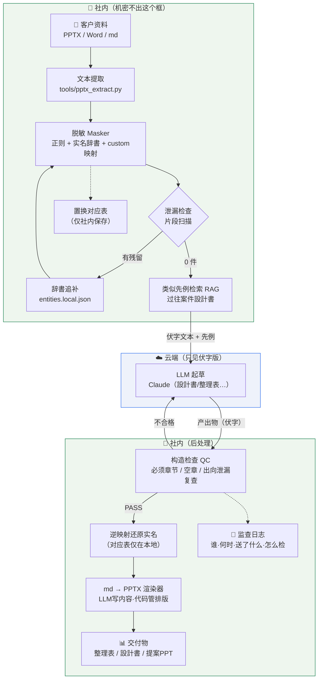
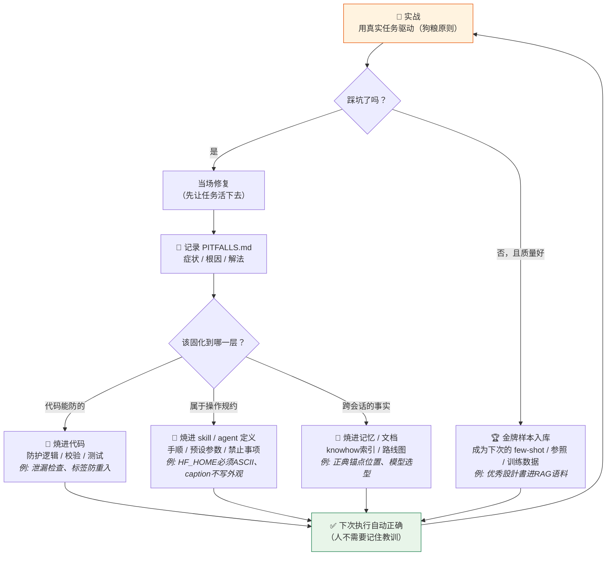

# 业务管线 Flow & Skill 培养概念图

> 2026-07-03。第一部分是 ai-stack 的处理流程；第二部分是让这套系统（和操作它的 AI agent）**越用越强**的方法论——skill 培养循环。两者配合：管线负责干活，循环负责成长。

---

## 一、业务管线全景（要件书 → 交付物）

**读图要点**：
- 两个绿框=本地、蓝框=云端。**穿越边界的只有伏字文本**，实名对应表永不出绿框
- 泄漏检查是双向的：出门前查一次，产出物回来再复查一次
- QC 不合格自动打回重新生成——人只审"PASS 后的成品"

---

## 二、Skill 培养循环（系统怎么越用越强）

核心思想：**skill 不是写出来的，是蒸馏出来的。** 每次实战踩的坑、赢的招，按性质沉淀到三个不同的层，下次执行时自动生效。

### 三层固化的选择标准

| 层 | 放什么 | 判断标准 | 今天的实例 |
|---|---|---|---|
| **代码** | 防护、校验、自动化 | "机器能检查的就不要靠人记" | 人名标签防重入、双向泄漏扫描、PPTX表格自动分页 |
| **skill / agent 定义** | 手顺、预设、规约、禁忌 | "每次执行都要遵守的操作纪律" | lora-train 的 16GB 预设、curator 的 caption 规约、masker 的实名辞書分离 |
| **记忆 / 文档** | 事实、路径、决策、路线 | "换个会话/换个人也要知道的背景" | 正典锚点位置、双模型分离结论、DGX 路线图 |

### 循环的两个引擎

1. **狗粮原则**（用真任务喂）：假任务练不出真 skill。今天 masker 的 6 项升级全部来自一份真实 PPTX——合成测试数据永远想不到"顧客側資料の人名は敬称なしが普通"。
2. **金牌样本回流**（好结果也要沉淀）：合格产出物不是终点——优秀設計書进 RAG 语料库让下次检索更准；QC 通过的图片进 LoRA 训练集让模型更像。**产出物即训练数据，用得越多系统越懂你。**

---

## 三、两条线是同一个循环（对照）

| 循环环节 | 图像线（画像生産PJ） | 业务线（ai-stack） |
|---|---|---|
| 实战驱动 | 真实量产需求 | 真实客户 PPTX |
| 踩坑记录 | 记忆 + skill 落とし穴节 | docs/PITFALLS.md |
| 焼进代码 | produce-qc 重构、helper 防护 | masker 升级、泄漏检查 |
| 焼进 skill | lora-train / nsfw-produce | CLAUDE.md 规约 |
| 金牌回流 | QC 合格图 → LoRA 数据集 | 优秀先例 → RAG 语料 |
| 成长证据 | 训练成果卡 | PHASE0-RESULTS.md |

> 给客户讲这页的话术：「我们交付的不是一个静态系统，而是一个**带成长机制的系统**——贵司用得越多，它越懂贵司的业务。这套成长机制本身，就是我们和"只会调 API 的公司"的区别。」
