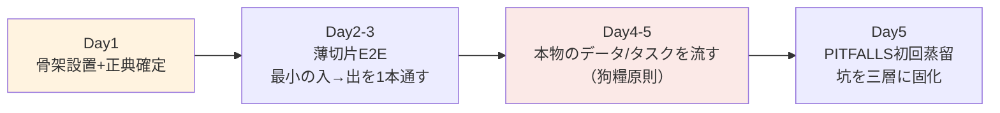

# 新プロジェクト STARTUP 標準 v1.0

> 制定: 2026-07-04。親文書: `AGENT育成標準.md`（原則はそちら、本書は立ち上げ手順）。
> 適用: AIエージェント/生成AIを使う新プロジェクト全て（画像・動画・文書・コード・音楽…領域不問）。
> **使い方: [`../ai-stack/templates/project-skeleton/`](../ai-stack/templates/project-skeleton/) をコピーして空欄を埋める。本書は埋め方の説明書。**

---

## 0. Day-0 決定事項（コードを書く前に決める5つ）

| # | 決定事項 | 問い | 未決定のまま進んだ場合の実績事故 |
|---|---|---|---|
| 1 | **正典（ground truth）** | この項目の「正しい」は何を基準に判定するか？その基準物はどこにあるか？ | 派生物を正典と誤認→生成56枚+選別33枚が全廃棄（miyu初回） |
| 2 | **機密等級** | 実名・顧客物・社外秘は入るか？→ 入るなら gitignore 規約とローカル分離を先に敷く | 実名辞書がコミットされる事故（未然防止済み） |
| 3 | **生成とQCの分離** | 誰が作り、誰が検査するか？（同一エージェント禁止） | 自産自評で甘いQC→破綻品が量産通過 |
| 4 | **結果庫のschema** | 何を記録するか？failure_modes語彙は？（§3の領域別表から開始） | 記録なし→当たりが再現不能（SUNO初期） |
| 5 | **置き場** | どのrepo？既存toolboxから何を借りるか？ | 車輪の再発明（渲染器・検査器は共用品） |

## 1. 初日にやること（30分）

1. [`../ai-stack/templates/project-skeleton/`](../ai-stack/templates/project-skeleton/) をプロジェクトルートへコピー
2. `CLAUDE.md`（またはプロジェクトの流儀のagent規約ファイル）の空欄を埋める: 正典の所在・機密等級・借用する共用ツール
3. `library/outcomes/README.md` の failure_modes を領域別表（§3）から選んで確定
4. git init + 初回コミット（機密等級に応じた .gitignore を先に）
5. CHANGELOG に「プロジェクト開始」1行

## 2. 第1週の標準進行

- **薄切片が先、完成度は後**: 全層を最小実装で1本つなぐ（各層のインターフェースを固定し、後から独立に厚くする）。UIや自動化は薄切片が通ってから。
- **実データは5日以内**: 合成テストで見えない坑が本物には必ずある。実データ投入日をDay1に予約する。
- 第1週の終わりに: PITFALLSが1件も無い＝実データを流していない疑い。

## 3. 領域別 failure_modes 起始語彙

| 領域 | 起始語彙（プロジェクトで追記していく） |
|---|---|
| 画像生成 | `anatomy` `extra_person` `identity_break` `style_drift` `wrong_costume` `composition_collapse` `text_garbled` `nsfw_leak` |
| 動画生成 | 画像語彙 + `morph` `motion_blur` `position_swap` `edge_crop` `invented_object` `face_collapse` `duration_waste` |
| 文書生成 | `missing_section` `empty_section` `terminology_error` `format_violation` `hallucinated_fact` `masking_leak` `tone_mismatch` |
| コード/ゲーム | `build_break` `style_bible_violation` `asset_dim_mismatch` `palette_mismatch` `tiling_seam` `regression` `perf_degrade` |
| 音楽 | `vocal_mismatch` `arrangement_drift` `diction` `energy_mismatch` `structure_violation` |

## 4. 卒業判定（このプロジェクトは標準に乗ったか）

四半期セルフチェック（全てYesで「乗った」）:

- ☐ 正典が文書化され、全員（人もagentも）が同じものを参照している
- ☐ 結果庫に成功と失敗の両方が溜まっている（失敗ゼロ＝記録していない疑い）
- ☐ 金牌庫に注釈付き範例が3件以上ある
- ☐ 直近の坑がコード層/規律層/記憶層のどれかに固化されている（PITFALLSに書いただけ、で止まっていない）
- ☐ 生成agentとQC agentが分離している
- ☐ 新メンバー（人でもagentでも）が骨架文書だけで参入できる

## 5. 立ち上げでよくある誤り（4系統の実績から）

1. **正典を決めずに生成を始める**（最頻・最も高くつく）
2. **QCを生成者に兼務させる**（必ず甘くなる。分離は初日から）
3. **「後でログを整備する」**（後は来ない。記録義務はagent定義に書く）
4. **最初から全自動を狙う**（薄切片→手動確認→段階自動化の順。QCゲートを飛ばした自動化は事故製造機）
5. **共用ツールを見ずに自作する**（渲染器・構造検査器・脱敏器・LoRA訓練預設は toolbox に有る）
6. **機密とrepoの分離を後回しにする**（最初のコミットに実名が入ったら取り消せない）

---

関連: `AGENT育成標準.md`（原則） / [`../ai-stack/templates/project-skeleton/`](../ai-stack/templates/project-skeleton/)（コピー元） / `AI研究会-学習と業適用の基礎.md`（学習原理）
