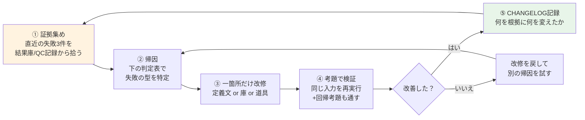

# 既存エージェント訓練ガイド v1.0
## — 社員がagentを「育てる」ための実務手順 —

> 制定: 2026-07-04。親文書: `AGENT育成標準.md`（原則）/ `新プロジェクトSTARTUP標準.md`（新規立ち上げ）。
> 本書は**すでに動いているagentの成績を上げる**方法。社内先例: MV制作PJの
> `mv-training-master` + `library/training_cases/`（オフライン演習方式）。

---

## 0. 大前提: agentの「重み」はどこにあるか

LLM本体は訓練しない（できないし、する必要もない）。agentの振る舞いを決めているのは:

1. **定義文**（system prompt / developer_instructions）— 規律・手順・禁止事項
2. **必読庫** — gold金牌庫・outcomes結果庫・参照ドキュメント
3. **道具** — 使えるツール・テンプレート・検査スクリプト

**訓練 = 証拠に基づいてこの3つを改良すること。** モデルのファインチューニングではない。
だから社員の誰でも・今日から・GPUなしでできる。

## 1. 訓練ループ（1回30分の標準セッション）

**鉄則: 一度に一箇所しか変えない。** 複数同時に変えると、どれが効いたか永遠に分からなくなる。

## 2. 失敗の帰因判定表（②で使う）

| 失敗の型 | 見分け方 | 処方 |
|---|---|---|
| **知識不足** | 「知らなかった」系。存在しない機能を前提にする、古い情報で動く | 必読ドキュメントを追加/更新。RAG化。定義文に参照義務を書く |
| **規律違反** | ルールはあるのに守らない。禁止語を使う、手順を飛ばす | 定義文の該当規則を**具体化**（「注意する」→「◯◯を含む案は却下」）。チェックリスト化。QC側にも検査を追加（二重防護） |
| **範例不足** | 形式は合っているが質が凡庸。「悪くないが良くもない」 | gold金牌庫に注釈付き範例を追加し、必読+適用パターン明示を義務化 |
| **文脈過大** | 長い入力の後半を無視する、途中から質が落ちる | タスクを分割（agentを2つに割る/工程を段階化）。入力を要約してから渡す |
| **能力不足** | 何度直しても構造的に無理（複雑な推論・特殊領域） | モデル/effortを上げる。道具（スクリプト・テンプレート）で機械化して負担を減らす |
| **仕様曖昧** | agentのせいではない。指示自体が二義的 | 発注側テンプレートを整備（brief書式）。agentに「曖昧なら質問せよ」を明記 |

> 帰因を間違えると処方も外れる。迷ったら「同じ失敗を人間の新人がしたら、何が足りないと言うか？」で考える。

## 3. 考題方式（オフライン演習 = MV制作PJ先例の一般化）

**考題 = 固定入力 + 期待される出力の要点 + 採点基準。** 実タスクを流さずに訓練・検証できる。

- 作り方: 過去の実タスクから「難しかった入力」を抜いて考題化。期待出力は採用版の要点
  （丸写し正解ではなく「これが入っていればPASS」の判定項目リスト）
- **回帰考題集**: 過去に直した失敗は必ず考題として残す。定義文を変えるたびに全考題を再実行
  →「新しい改修が古い能力を壊していないか」を機械的に確認（モデル更新時も同じ考題で健診）
- 置き場: `library/training_cases/<agent名>/case_NN.md` + 採点記録

## 4. 変体競争（大きな改修のとき）

定義文を大きく変えるときは、旧版と新版を**同じ考題セットで並走**させ、比較採点で勝者を採用。
感触ではなく点数で決める。第三者agent（または別の社員）が採点すること（自分の改修に人は甘い）。

## 5. 社員の役割 = ユーザーではなくコーチ

| 場面 | ユーザー的行動（×） | コーチ的行動（○） |
|---|---|---|
| agentが失敗した | 手で直して終わり | 手で直す **+ 結果庫に1行 + 帰因メモ** |
| agentが当たった | 使って終わり | **なぜ良いかを注釈してgold庫へ**（2分） |
| 同じ失敗が2回目 | またか、と手で直す | **訓練セッション発動**（2回目=定義文行き確定のサイン） |
| 改修した | 使い続ける | **考題で検証 + CHANGELOG**（根拠と変更内容） |

訓練コストの実感値: 訓後記録は1回2分。訓練セッションは週1回30分で十分回る。
これを惜しむと同じ失敗を毎週手で直し続けることになる（そちらの方が高い）。

## 6. 成績の見える化（agent成績カード）

agentごとに四半期で記録（結果庫から集計）:

- 一発PASS率 / 平均リトライ回数 / 返工率の推移
- 直近の帰因内訳（知識/規律/範例/文脈/能力/仕様）
- 定義文の版数と直近の改修内容

**PASS率が上がっていない訓練は訓練ではない。** 数字が動かないなら帰因が間違っている。

## 7. よくある誤り

1. **定義文に「もっと注意深く」系を足す** — 精神論は効かない。具体的な検査手順か禁止条件に変換する
2. **失敗のたびに定義文を膨らませる** — 肥大した定義文は後半が無視される。追加したら古い冗長規則を削る（定義文も結果庫でA/B）
3. **成功例を記録しない** — 失敗だけ集めるとagentは「やってはいけない事の百科事典」になり萎縮する。goldが方向を教える
4. **人が直して黙っている** — 修正内容こそ最高の教材。改前/改後ペアは考題の種
5. **一度に複数箇所を改修**（§1の鉄則違反）
6. **考題なしのモデル更新** — 基盤モデルが変わると得意不得意が変わる。回帰考題で健診してから本番投入

---

関連: `AGENT育成標準.md` §5(QC規律) / MV制作PJ `library/training_cases/`（実例） /
`library/prompt_outcomes/`（結果庫の実例） / `library/story_gold/`（金牌庫の実例）
